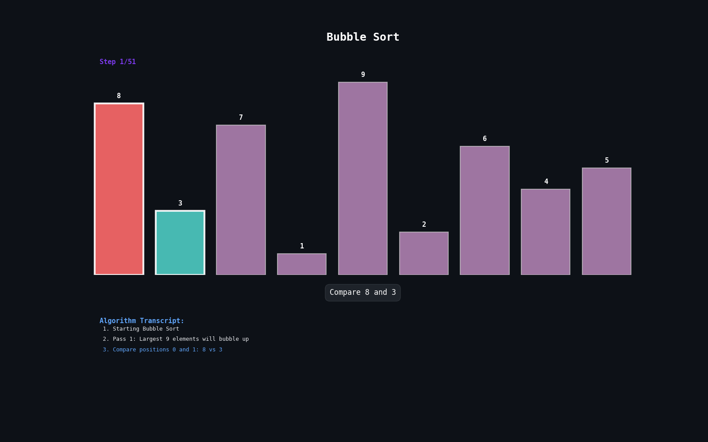

# Sorting Algorithm Visualizer


A **professional sorting algorithm visualizer** in Python using Matplotlib.  
This project generates **animated GIFs** for multiple sorting algorithms, highlighting comparisons, swaps, pivots, and other key steps with a clear transcript.

## GIF Preview



## Table of Contents

- [Features](#features)
- [Installation](#installation)
- [Usage](#usage)
- [Folder Structure](#folder-structure)
- [Customization](#customization)
- [Example Output](#example-output)
- [License](#license)

## Features

- **Algorithms included:**

  - Bubble Sort
  - Insertion Sort
  - Selection Sort
  - Quick Sort
  - Heap Sort
  - Shell Sort
  - Counting Sort
  - Merge Sort

- **Professional visuals:**
  - Color-coded bars for each action type
  - Step-by-step animated sorting
  - Transcript showing last 6 steps
  - Step counter display
  - GIF output for each algorithm

---

## Installation

### 1. Clone the repository:

```bash
git clone https://github.com/edemyakoubi/sorting-algorithm-visualizer.git
cd sorting-algorithm-visualizer
```

### 2.Install dependencies (Python 3.8+ recommended):

```bash

pip install matplotlib numpy pillow
```

#### Alternatively, you can create a requirements.txt with the following content and install all dependencies at once:

- nginx
- Copy code
- matplotlib
- numpy
- pillow

#### Then install all dependencies at once:

```bash
pip install -r requirements.txt
```

## Usage

#### Run the main script to generate GIFs for all sorting algorithms:

```bash
python sorting_visualizer.py
```

- GIFs will be saved in the gifs/ folder.
- Each GIF is automatically named after the algorithm (e.g., bubble_sort.gif).

## Folder Structure

```bash
sorting-algorithm-visualizer/
│
├─ sorting_visualizer.py # Main Python script
├─ gifs/ # Generated GIFs
├─ requirements.txt # Dependencies (optional)
└─ README.md # This file

```

## Customization

- Change the array to sort by modifying the arr variable in main().
- Adjust animation speed by changing the interval in FuncAnimation.
- Modify colors by editing get_color_scheme() for different action types.

## Example Output

- Each GIF shows:

  - Bar heights representing array values

  - Color-coded actions:

    - Comparisons

    - Swaps

    - Pivot selection

    - Insertions, shifts, heap operations

  - Step counter and transcript display

## License

- This project is open-source. Modify, share, and use it for educational purposes.

Created with ❤️ by Edem
